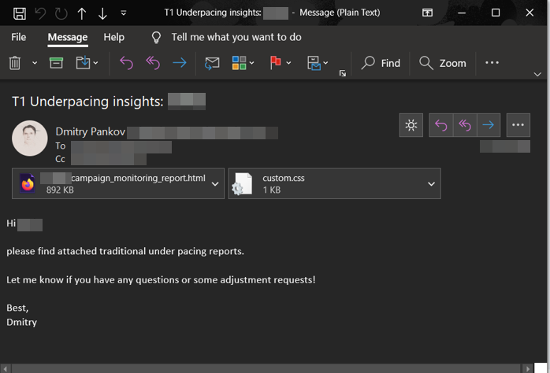

# underpacicus

Automated solution for generating and sending recommendations to the online marketing managers/traders to help keep their campaigns healthy and on pace.

# logic of code

This program:

- takes input about under- and outpacing campaigns from Looker table via Looker API
- filters campaigns on the given criteria's (advertiser name/ids, volume of underpacing)
- gets data about campaign and strategy set up from T1 API (https://apidocs.mediamath.com/)
- compares the given settings with recommended one and shows the way ho 
- creates HTML (code-free) file and send it via e-mail to the client
- ads the sent recommendations regarding problematic campaigns (with under- and outpacing) to SQLite database for past mail analysis

# usage

To make this program run:

- in the script **Campaigns_monitoring_report.ipynb** replace 'xxx' placeholders by your Looker API and T1 API credentials in the beginning, adjust mail addresses at the end 
- install the custom created 'scripticus'-package via git:  !pip install --upgrade git+https://github.com/pandmi/scripticus.git
- run the script, aprox. execution time 5-15 mins, depends on the account size 

# output

The result of script execution is a mail with attached html-file:

For confidential reasons some parts of the html-output were blurred:

In the same folder among with Campaigns_monitoring_report.ipynb should be placed created SQLite database file: databasicus.db, which can be used for past mail analysis. 
The past mail analysis might help to identify most frequent optimization problems.

# improvement to be made

- filter function on every table
- deployment as stand alone application
- remove looker api dependencies in order to get analysis based on only T1 API data 
- diverse output format, as .xls, .pdf

