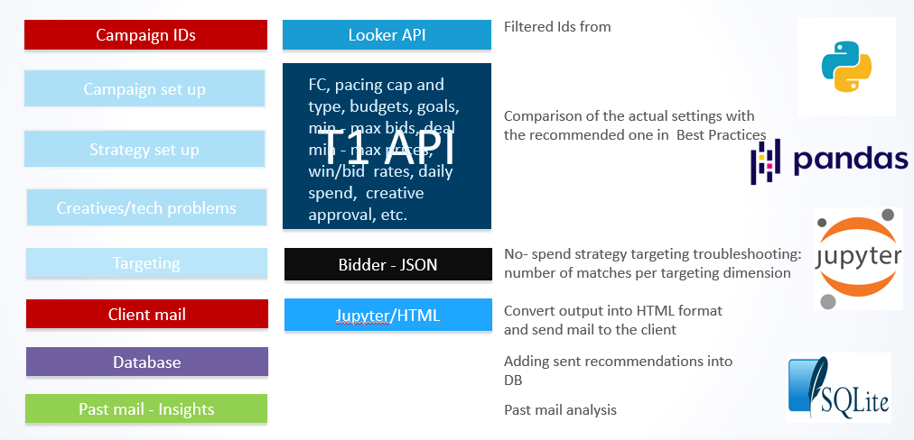
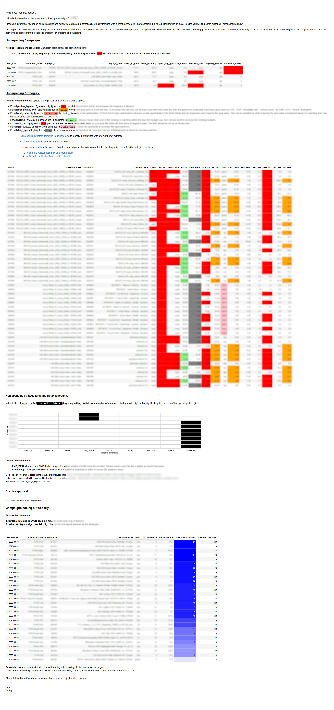

# underpacicus

Automated solution for generating and sending recommendations to the online marketing managers/traders to help keep their campaigns healthy and on pace.

# logic of code

This program:

- takes input about under- and outpacing campaigns from Looker table via Looker API
- filters campaigns on the given criteria's (advertiser name/ids, volume of underpacing)
- gets data about campaign and strategy set up via T1 API (https://apidocs.mediamath.com/)
- compares the given settings with recommended one and shows the way ho 
- creates HTML (code-free) file and send it via e-mail to the client
- ads the sent recommendations regarding problematic campaigns (with under- and outpacing) to SQLite database for past mail analysis

# usage

To make this program run:

- in the script **Campaigns_monitoring_report.ipynb** replace 'xxx' placeholders by your Looker API and T1 API credentials in the beginning, adjust mail addresses 
- install the custom created 'scripticus'-package via git:  !pip install --upgrade git+https://github.com/pandmi/scripticus.git
-  run the script, aprox. execution time 5-15 mins, depends on the account size 

# output

The result of script execution is a mail:

- with html-file as output, For confidential reasons some parts of the output were blurred.

In the same folder should be placed create SQLite database. The past mail analysis might help you to identify common problems and most

# improvement to be made

- filter function on every tables
- deployment as stand alone application
- remove looker api dependencies in order to get analysis based on only T1 API data 
- diverse output format, as .xls, .pdf

